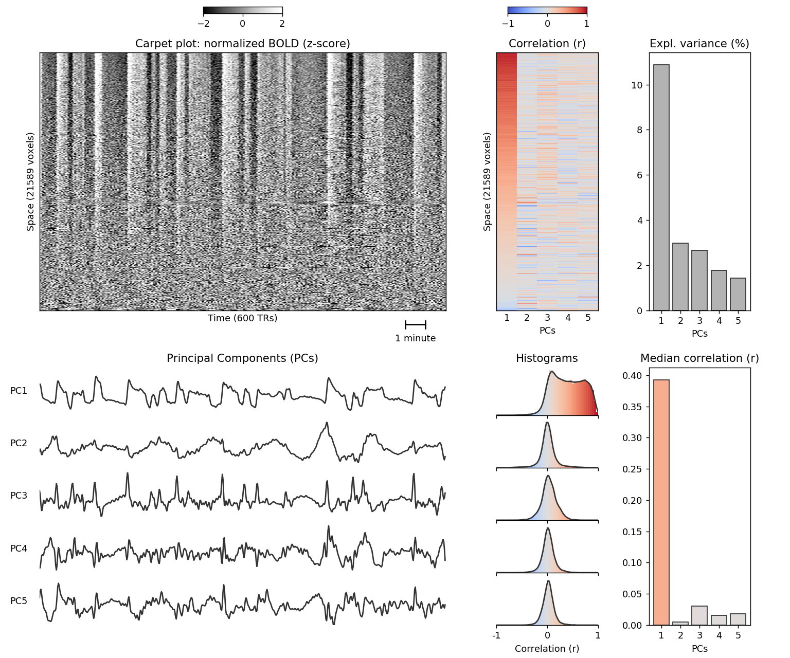

# pcarpet
[](https://pcarpet.readthedocs.io/en/latest/?badge=latest)
[](https://zenodo.org/badge/latestdoi/335618853)


`pcarpet` is a small python package that creates a **carpet plot** from fMRI data and decomposes it with **PCA**.

**Author:** [Nikoloz Sirmpilatze](https://github.com/niksirbi) ([German Primate Center](https://www.dpz.eu/))

**Citing pcarpet:** If you use `pcarpet` in a scientific publication, please cite the following manuscript preprint:

Sirmpilatze N, Mylius J, Ortiz-Rios M, Baudewig J, Paasonen J, Golkowski D, Ranft A, Ilg R, Gröhn O, Boretius S. 2021. *Spatial signatures of anesthesia-induced burst-suppression differ between primates and rodents.* bioRxiv. doi:10.1101/2021.10.15.464515


**Links:**

1. [Documentation](https://pcarpet.readthedocs.io/en/latest/)
2. [Preprint on bioRxiv](https://www.biorxiv.org/content/10.1101/2021.10.15.464515)


**Overview:**

- [Rationale](#rationale) 
- [How it works](#how) 
- [Installation](#install) 
- [Usage](#use) 
- [Acknowledgements](#thanks) 

<a name="rationale"></a>
## Rationale
A 'carpet plot' is a 2d representation of fMRI data (voxels x time), very similar to 'The Plot' described by Jonathan D Power ([Power 2017](https://www.sciencedirect.com/science/article/abs/pii/S1053811916303871?via%3Dihub)). 
This visual representation of fMRI data is suited for identifying wide-spread signal fluctutations 
([Aquino et al. 2020](https://www.sciencedirect.com/science/article/pii/S1053811920301014)), 
which often come from non-neural sources (e.g. head motion).

That said, the carpet plot can also reveal 'real' neural activity, especially when the activity is slow and synchronous, as is the case for **anesthesia-induced burst-suppression** ([Sirmpiltze et al. 2021](https://www.biorxiv.org/content/10.1101/2021.10.15.464515)).
The `pcarpet` package implements the analytical pipeline used in the [Sirmpiltze et al. 2021](https://www.biorxiv.org/content/10.1101/2021.10.15.464515) paper to identify instances of burst-suppression in anesthetized humans, nonhuman primates, and rats.

<a name="how"></a>
## How it works
The pipeline consists of the following steps:

1. First tha necessary data is imported, consisting of a preprocessed fMRI scan (4d NIFTI file) and a mask (3d NIFTI file) defining a single region-of-interest.
2. A carpet plot is generated from within the mask. To make wide-spread fluctuations more visually prominent, the voxel time-series (carpet rows) are normalized (z-score) and re-ordered according to their correlation with the mean time-series.
3. Principal Component Analysis (PCA) is applied to the carpet matrix (using the `scikit-learn` implementation) and a given number (`ncomp`, default is 5) of first Principal Components - hereafter referred to as 'fPCs' - is extracted. The fPCs (e.g. PC1 - PC5) represent the temporal patterns of activity with the highest explained variance ratios.
4. The fPCs are correlated with all voxel time-series within the carpet to get a distribution of Pearson's correlation coefficients (*r*) per fPC.
5. The fPCs are also correlated with the entire fMRI scan, including areas outside the mask, to get the brain-wide spatial distribution of each fPC.
6. A visual summary of results from steps 1-4 is plotted (example below).



The above image corresponds to an instance of burst-suppression in a female long-tailed macaque (*Macaca fascicularis*) anesthetized with isoflurane. The carpet plot (using a cortical mask) shows a wide-spread, slow, quasi-periodic signal fluctuation, which is well captured by PC1. PC1 is positively correlated with most cortical voxel timeseries, resulting in a heavily asymmetric distribution of correlation coefficients (*r*), while PCs 2-4 show symmetric *r* histograms centered on zero. This property can be quantified by taking the median of carpet-wide *r* values (bottom right). According to the terminology introduced in Sirmpilatze et al. 2021, PC1 is an 'asymmetric PC`. Under the right circumstances, the presence of an asymmetric PC in a cortical carpet plot can be an fMRI signature of burst-suppression, with the brain-wide distribution of the asymmetric PC representing a map of burst-suppression (see manuscript for details).

<a name="install"></a>
## Installation

### a. pip
You can install the latest release from PyPI via

```python
pip install pcarpet
```

Pip will try to ensure that the following requirements are satisfied:

1. Python 3.6 or higher
2. [numpy](https://numpy.org/)
3. [scipy](https://scipy.org/)
4. [matplotlib](https://matplotlib.org/)
5. [pandas](https://pandas.pydata.org/)
6. [scikit-learn](https://scikit-learn.org/stable/)
7. [nibabel](https://nipy.org/nibabel/)

### b. Anaconda
If you are having issues with resolving package dependencies, you can create a virtual environment using [Anaconda](https://www.anaconda.com/products/individual):

1. Install an Anaconda distribution of python 3, choosing your operating system.
2. Download the `environment.yml` file from this repository. You can clone the repository or copy-paste the file contents into a text document on your local computer.
3. Open a terminal/anaconda prompt with conda for python 3 in the path.
4. Navigate to the directory where the `environment.yml` is stored and run `conda env create -f environment.yml`
5. Activate the environment with `conda activate pcarpet-env` (Note: you will always have to activate `pcarpet-env` before using `pcarpet`)

<a name="use"></a>
## Usage
Running `pcarpet` only requires 3 arguments (paths):

1. **fMRI file**: a 4d nifti file containing the preprocessed fMRI data
2. **Mask file**: a 3d nifti file, containing a binary mask that defines a region-of-interest (e.g. cortex)
3. **Output folder**: for storing the outputs generated by pcarpet

```python
import pcarpet

MyData = pcarpet.Dataset(fmri_file, mask_file, output_folder)
MyData.run_pcarpet()
```

Detailed instructions on running `pcarpet` are available as a [jupyter notebook](doc/example_usage.ipynb). The notebook runs `pcarpet` on some example data, either in a single step (as above) or by separately calling the various parts of the pipeline. It also explains the optional arguments and the outputs of the pipeline. If you wish to run the notebook locally, make sure that [jupyter](https://jupyter.org/) is installed in your programming environment.

<a name="thanks"></a>
## Acknowledgements
This project was created using the [shablona template](https://github.com/uwescience/shablona).

